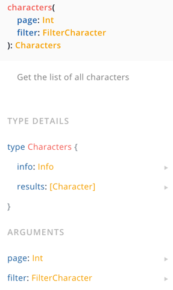
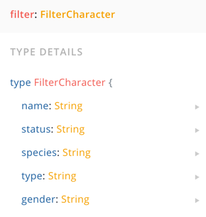

# Tiny Pets API

Example: [Rick and Morty API](https://rickandmortyapi.com)

- [GraphQL](https://rickandmortyapi.com/graphql)
- [REST](https://rickandmortyapi.com/api)

```gql
# Write your query or mutation here
query AllCharacters {
  characters {
    results {
      name
    }
  }
}
```

```gql
# with args:
query AllCharacters {
  characters(page: 2) {
    # arguments
    results {
      name
    }
  }
}
```



```gql
query AllCharacters {
  characters(page: 2, filter: { name: "Morty" }) {
    # arguments
    results {
      name
    }
  }
}
```



Server runs at: http://localhost:4567/

Uses:

https://github.com/typicode/lowdb
